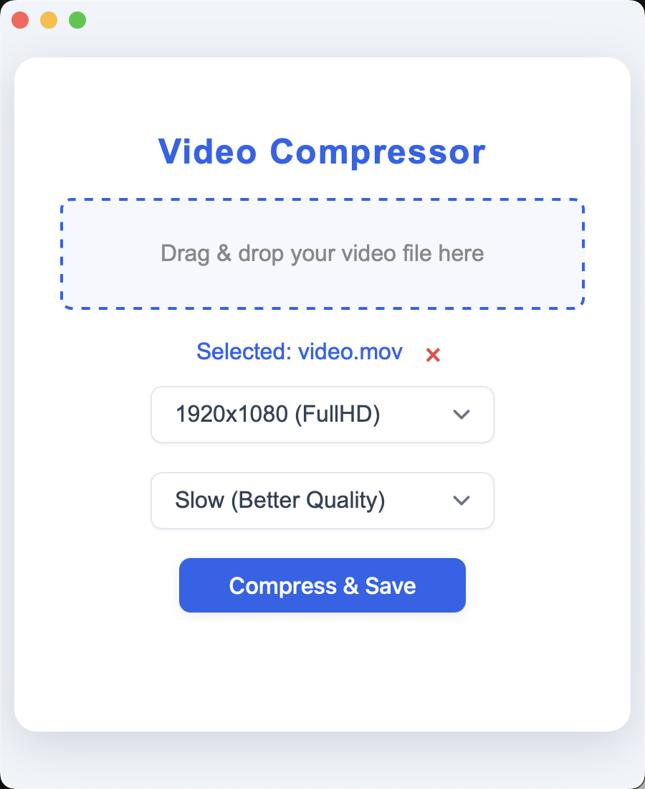

# Video Compressor

A simple desktop application built with Wails for compressing video files. Easily drag and drop your video, select a target resolution, and compress it.

## Features

*   **Drag & Drop Interface**: Easily add video files by dragging them onto the application window.
*   **Resolution Selection**: Choose from predefined resolutions (e.g., 1920x1080, 1280x720, 854x480) for compression.
*   **Simple Compression**: Compresses video and saves the output file.

## Installation

The easiest way to install the Video Compressor is to download the appropriate archive for your operating system from the [Releases page](https://github.com/hheimerd/video-compressor/releases).

### macOS

If you encounter a warning that the application cannot be opened because the developer cannot be verified:

1.  Hold the **Option** key.
2.  **Right-click** (or **Control-click**) the application icon.
3.  Select **Open** from the menu.
4.  Click **Open** in the confirmation dialog.

## How to Use

1.  **Drag and Drop**: Drag your video file into the designated "Drag & drop your video file here" area.
2.  **Select Resolution**: Choose your desired output resolution from the dropdown menu.
3.  **Compress**: Click the "Compress & Save" button to start the compression process.
4.  **Save**: The compressed video will be saved to a new file.

## Building from Source

Refer to `CONTRIBUTING.md` for instructions on how to set up the development environment and build the application from source.